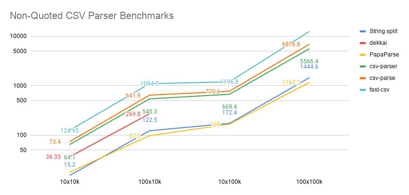
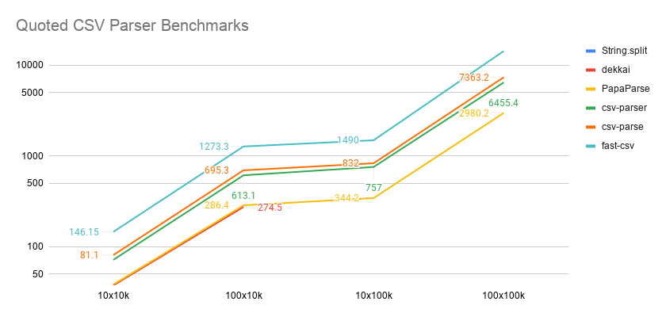

# csv-parsers-benchmarks
Benchmarks of popular CSV parsers:
* Simple String.split (only non-quoted data)
* [PapaParse](https://www.papaparse.com/)
* [csv-parser](https://www.npmjs.com/package/csv-parser)
* [csv-parse](https://csv.js.org/parse/)
* [dekkai](https://www.npmjs.com/package/dekkai)
* [fast-csv](https://www.npmjs.com/package/fast-csv)
  
The tests run on generated data files with 10/100 columns and 10k/100k rows, both quoted and unquoted. 
The first column is numeric and used for the ``sum`` validation. The rest are just strings and not used in the tests directly.

## Results 
Benchmarked on i5-8350U/16Gb RAM/SSD running Ubuntu 20.04

### Non-Quoted CSV files

PapaParse was running in fast mode. Dekkai was crashing the whole process on 100k rows tests, so there are no results. We've also added a simple ``String.split`` approach here for comparison with full-featured compliant parsers. It should be treated only as a baseline.

### Quoted CSV Files

All parsers performed a little worse on quoted data. Dekkai was crashing again on 100k rows tests and was disabled. PapaParse was running with fast mode disabled. ``String.split`` won't work for the quoted data in general and implementing proper parsing is not that trivial. 

Read more in our [CSV Parsers Comparison](https://leanylabs.com/blog/js-csv-parsers-benchmarks/).